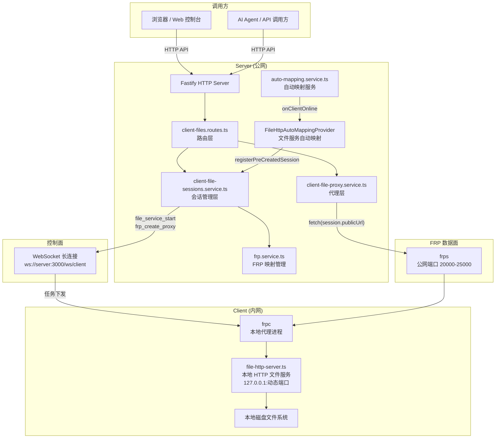
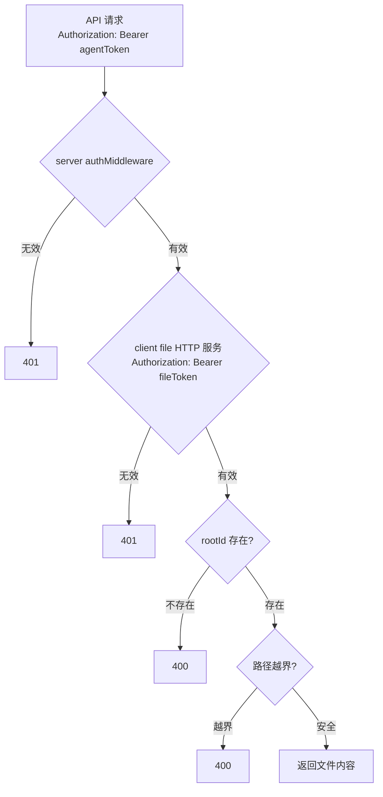
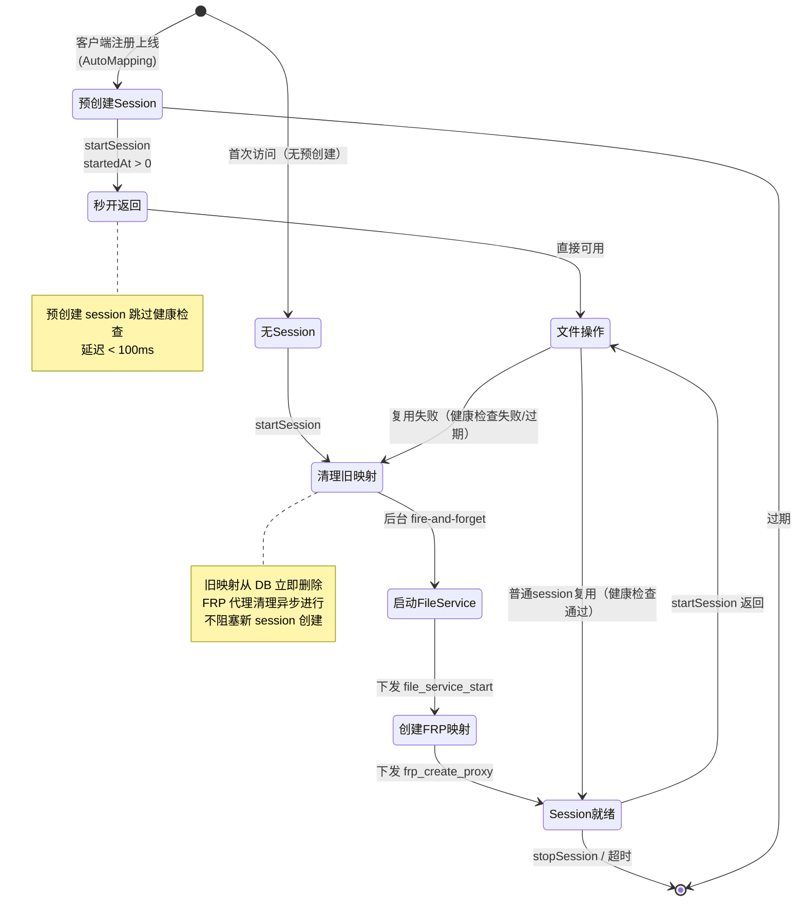
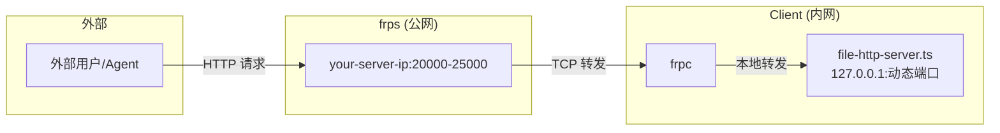

# 客户端文件管理实现说明

## 概述

Remote Agent Gateway 的客户端文件管理通过 **FRP 数据面隧道 + 客户端本地 HTTP 服务** 实现，允许 AI Agent / Web 控制台浏览、读取、下载、上传、写入和控制客户端机器上的文件，同时受 `allowedRoots` 权限约束。

核心思路：**控制面走 WebSocket，文件数据面走 FRP HTTP 隧道。**

---

## 整体架构



---

## 会话创建机制：预创建 + 按需双路径

文件会话有两种创建路径，`startSession()` 会优先选择最快的方式：

```mermaid
flowchart TD
    A[用户点击"客户端文件"] --> B[startSession]
    B --> C{已有预创建 session?}
    C -->|是| D{未过期?}
    D -->|是| E["⚡ 秒开（<100ms）<br/>直接返回预创建 session"]
    D -->|否| F[清除过期 session<br/>后台清理旧映射]
    C -->|否| G{已有普通 session?}
    G -->|是| H{健康检查通过?}
    H -->|是| I[返回现有 session]
    H -->|否| F
    G -->|否| F
    F --> J[创建新 session<br/>启动 file_service → FRP 映射]
    J --> K[返回新 session]

    L[客户端注册上线] --> M[FileHttpAutoMappingProvider.onClientOnline]
    M --> N[启动 file_service]
    N --> O[创建 FRP 映射]
    O --> P[registerPreCreatedSession]
    P --> D

    style E fill:#3fb950,color:#000
    style P fill:#58a6ff,color:#000
```

### 路径 1：预创建（客户端注册时）— 秒开

客户端注册上线时，`FileHttpAutoMappingProvider.onClientOnline()` 自动完成：

1. 下发 `file_service_start` 任务到客户端，启动本地 HTTP 文件服务
2. 创建 FRP 端口映射
3. 下发 `frp_create_proxy` 任务到客户端，建立 frpc → frps 隧道
4. **调用 `registerPreCreatedSession()` 将 session（含 token、publicUrl）注册到 `clientFileSessionsService`**

当用户点击"客户端文件"时，`startSession()` 发现已有预创建 session（`startedAt > 0`），**跳过健康检查直接返回**，实现秒开体验。

### 路径 2：按需创建（首次无缓存或 session 过期）

如果预创建 session 已过期或不存在，走完整的按需创建流程：

1. 后台 fire-and-forget 清理旧映射（不阻塞）
2. 下发 `file_service_start` 任务
3. 创建 FRP 端口映射
4. 下发 `frp_create_proxy` 任务
5. 缓存新 session

### 对比

| 场景 | 路径 | 延迟 |
|------|------|------|
| 客户端已注册（预创建 session 有效） | 路径 1 秒开 | **< 100ms** |
| 客户端已注册（预创建 session 过期） | 路径 2 | ~2-5 秒 |
| 首次访问无缓存 | 路径 2 | ~2-5 秒 |

---

## 文件下载完整流程

```mermaid
sequenceDiagram
    participant Browser as 🌐 浏览器/API 调用方
    participant Route as 📡 Server 路由层<br/>client-files.routes.ts
    participant Session as 🔐 Session 管理层<br/>client-file-sessions.service.ts
    participant Proxy as 🔄 Server 代理层<br/>client-file-proxy.service.ts
    participant FRP as 🌉 FRP 隧道<br/>frps → frpc
    participant FileHTTP as 📁 Client 文件服务<br/>file-http-server.ts
    participant Disk as 💾 Client 本地磁盘

    Browser->>Route: GET /api/clients/:clientId/files/download<br/>?rootId=root-0&path=notes/a.txt

    rect rgb(240, 248, 255)
        Note over Route,Session: ① 会话就绪阶段
        Route->>Session: getSession(clientId)
        alt 预创建 session 存在且未过期
            Session-->>Route: ⚡ 直接返回 session（秒开）
        else session 不存在
            Note over Session: 1. 后台清理旧映射（fire-and-forget）<br/>2. 下发 file_service_start 任务<br/>3. 创建 FRP 端口映射<br/>4. 下发 frp_create_proxy 任务
            Session-->>Route: session { publicUrl, token }
        end
    end

    rect rgb(255, 248, 240)
        Note over Route,FRP: ② 代理请求阶段
        Route->>Proxy: download(session, rootId, path)
        Proxy->>FRP: fetch(session.publicUrl + '/v1/download?rootId=root-0&path=notes/a.txt')<br/>Authorization: Bearer <token>
    end

    rect rgb(240, 255, 240)
        Note over FRP,Disk: ③ 文件读取阶段
        FRP->>FileHTTP: GET /v1/download?rootId=root-0&path=notes/a.txt
        FileHTTP-->>FileHTTP: 校验 Authorization + CORS
        FileHTTP-->>FileHTTP: 解析 rootId + path → 绝对路径
        FileHTTP-->>FileHTTP: 校验路径不越界（allowedRoots 内）
        FileHTTP->>Disk: fs.readFileSync(fullPath)
        Disk-->>FileHTTP: 文件二进制内容
        FileHTTP-->>FRP: HTTP 200 + Content-Disposition + 文件内容
    end

    rect rgb(248, 240, 255)
        Note over FRP,Browser: ④ 透传阶段
        FRP-->>Proxy: HTTP Response
        Proxy-->>Route: HTTP Response
        Route-->>Route: 保留 Content-Disposition 头
        Route-->>Browser: HTTP 200<br/>Content-Type: application/octet-stream<br/>Content-Disposition: attachment; filename="a.txt"<br/>文件内容
    end
```

---

## `read` 与 `download` 的区别

| 接口 | 路径 | 前端行为 | 实现差异 |
|------|------|----------|----------|
| 读取 | `GET /api/clients/:clientId/files/read` | 浏览器尝试预览/直接展示内容 | **不透传** `Content-Disposition` |
| 下载 | `GET /api/clients/:clientId/files/download` | 浏览器弹出下载对话框 | **透传** `Content-Disposition: attachment` |

两端实现：

- **client 端**（`file-http-server.ts`）：`/v1/read` 和 `/v1/download` 走**同一个 handler**，都返回 `Content-Disposition` 头。
- **server 端**（`client-files.routes.ts`）：唯一区别是 `/files/download` 会把 client 返回的 `Content-Disposition` **透传给调用方**，而 `/files/read` 不保留。

---

## 安全层次



### 三层安全

1. **API 鉴权**：所有 `/api/clients/:clientId/files/*` 请求必须带有效的 `admin_token` 或 `agent_api_token`
2. **文件服务鉴权**：client 本地 HTTP 服务每次请求校验 `fileToken`（每次 session 动态生成）
3. **路径约束**：
   - 客户端通过 `allowedRoots` 声明可访问的根目录
   - 每个 `rootId` 对应一个绝对路径
   - 禁止 `..` 路径穿越
   - 禁止绝对路径

### CORS 支持

客户端文件 HTTP 服务（`file-http-server.ts`）已添加 CORS 支持：

- 所有响应自动附带 `Access-Control-Allow-Origin: *` 等标准 CORS 头
- `OPTIONS` 请求返回 `204 No Content`，允许跨域预检
- 文件下载响应同样包含 CORS 头，确保浏览器端代理请求畅通

---

## 会话生命周期



### 关键优化

| 优化项 | 描述 |
|--------|------|
| **预创建 session 秒开** | 客户端注册时预创建的 session，`startSession()` 直接返回，不做健康检查 |
| **5 秒健康检查超时** | `isSessionHealthy()` 使用 `AbortController` 设置 5 秒超时，防止网络问题时无限挂起 |
| **Fire-and-forget 清理** | 旧映射从 DB 立即删除，FRP 代理清理任务异步下发，3 秒超时等待 frps 释放 |
| **前端加载动画** | `initFileSession()` 调用期间显示旋转 spinner + "正在连接客户端文件服务..." |

---

## FRP 端口映射模型



### 映射名称格式

| 来源 | 格式 | 代理类型 |
|------|------|----------|
| 自动映射（预创建） | `auto-file-http-{clientId}` | `http` |
| 按需创建 | `file-service-{clientId}-{token后8位}` | `tcp` |

> **注意**：预创建和按需创建使用不同的代理类型（http vs tcp），但两者都能通过 `publicUrl` 正常访问文件服务。

---

## 关键代码路径

| 层级 | 文件 | 职责 |
|------|------|------|
| Server 路由 | `apps/server/src/modules/client-files/client-files.routes.ts` | API 入口，参数校验，响应透传 |
| Server 代理 | `apps/server/src/modules/client-files/client-file-proxy.service.ts` | 通过 FRP 隧道代理请求到 client 本地 HTTP 服务 |
| Server 会话 | `apps/server/src/modules/client-files/client-file-sessions.service.ts` | fileSession 生命周期管理，FRP 映射创建/销毁，**预创建 session 注册与秒开** |
| Server 自动映射 | `apps/server/src/modules/auto-mapping/providers/file-http.provider.ts` | 客户端上线时自动创建文件服务 + FRP 映射，**注册预创建 session** |
| Server 自动映射服务 | `apps/server/src/modules/auto-mapping/auto-mapping.service.ts` | 管理各 AutoMappingProvider 的生命周期 |
| Server FRP | `apps/server/src/modules/frp/frp.service.ts` | 端口映射 CRUD，端口分配 |
| Client 文件服务 | `apps/client/src/runtime/file-http-server.ts` | 本地 HTTP Server，处理文件 CRUD，路径安全校验，CORS 支持 |
| Client 路径解析 | `apps/client/src/runtime/file-roots.ts` | rootId → 绝对路径解析，越界检查 |
| Client 文件工具 | `apps/client/src/runtime/file-paths.ts` | 文件条目/状态构造 |
| Client frpc 守护 | `apps/client/src/runtime/frpc-daemon.ts` | frpc 进程管理，孤儿进程回收 |
| Shared 类型 | `packages/shared/src/types.ts` | ClientFileRoot 等共享类型定义 |
| Shared Schema | `packages/shared/src/schemas.ts` | Zod 校验规则 |
| 前端页面 | `apps/server/src/web/index.html` | 单页管理控制台，文件管理 UI，加载动画 |

---

## ClientFileSession 数据结构

```typescript
interface ClientFileSession {
  clientId: string;    // 客户端 ID
  token: string;       // 文件服务鉴权 token（file_xxx 格式）
  localPort: number;   // 客户端本地文件服务端口
  mappingId: string;   // FRP 映射 ID
  publicUrl: string;   // 通过 FRP 隧道可访问的公网 URL
  startedAt: number;   // 服务启动时间戳（预创建 session > 0，按需创建为任务返回值）
  expiresAt: number;   // 过期时间戳（默认 30 分钟）
}
```

### `startedAt` 字段的特殊含义

- **`startedAt > 0`**：来自预创建 session（由 `FileHttpAutoMappingProvider` 注册），`startSession()` 会**跳过健康检查直接返回**
- **`startedAt === 0`**：来自旧式按需创建的 session，`startSession()` 会**执行健康检查**后再决定是否返回

---

## 与"服务端文件仓库"的对比

| 特性 | 服务端文件仓库 | 客户端文件管理 |
|------|---------------|---------------|
| API 前缀 | `/api/files` | `/api/clients/:clientId/files` |
| 文件位置 | server 本地 `storage/files/` | client 本地磁盘 |
| 传输方式 | 直接从 server 磁盘读取 | 经 FRP 隧道从 client 拉取 |
| 权限控制 | server token | server token + fileToken + allowedRoots |
| 文件上传 | multipart 上传到 server | 经 FRP 隧道上传到 client |
| 移动/复制 | 不支持 | 支持 |
| 首次访问延迟 | 无（本地磁盘） | **预创建 < 100ms，按需 ~2-5 秒** |